# processChangesWasm — Flow Chart

Maps every function call, input/output types, and side effects (logs, debug tracking) in the WASM pipeline implementation.

All data flows as `PipelineChange` — normalized once at entry, carried through every stage.
Meta is a plain object on `PipelineChange` and crosses the WASM boundary as a `serde_json::Value` (no stringify/parse).

```mermaid
flowchart TD
    A(["processChangesWasm
━━━━━━━━━━━━━━━━━━━━━━━━━━━━━━━
store:          StoreInstance
initialChanges: ['user.email', 'alice@x.com', {}][]"]) --> B{"pipeline
null?"}

    B -- yes --> WARN["console.warn
'processChanges called with no active pipeline'"]
    WARN --> RETURN_EARLY([return])

    B -- no --> C["normalizeInputChanges
━━━━━━━━━━━━━━━━━━━━━━━━━━━━━━━
in:  ['user.email', 'alice@x.com', {source:'form'}][]
out: PipelineChange[]
     [{ path:'user.email', value:'alice@x.com',
        meta:{source:'form'}, source:'user', type:'state' }]"]

    C --> D{"store._debug
enabled?"}
    D -- yes --> E["init trackEntry
━━━━━━━━━━━━━━━━━━━━━━━━━━━━━━━
{ input: [...initialChanges],
  applied: [],
  appliedConcerns: [],
  timestamp: 1709123456789 }"]
    D -- no --> F["trackEntry = null"]
    E --> G
    F --> G

    G["t0 = performance.now()  →  number (ms)"] --> H

    H["toWasmChanges + pipeline.processChanges
━━━━━━━━━━━━━━━━━━━━━━━━━━━━━━━
in:  PipelineChange[] → Change[]
     [{ path:'user.email', value:'alice@x.com',
        meta:{source:'form'} }]
     (meta crosses as serde_json::Value — no stringify)
out: {
  listener_changes:   Change[]  (meta preserved)
  execution_plan:     FullExecutionPlan | null
  validators_to_run:  ValidatorDispatch[]
  has_work:           boolean
}"]

    H --> I{"has_work?"}
    I -- no --> I1{"trackEntry?"}
    I1 -- yes --> I2["store._debug.calls.push(trackEntry)"]
    I1 -- no --> RETURN_EARLY2([return])
    I2 --> RETURN_EARLY2

    I -- yes --> J["normalizeWasmChanges(listener_changes)
━━━━━━━━━━━━━━━━━━━━━━━━━━━━━━━
in:  Change[]  (meta as plain object from WASM)
out: PipelineChange[]
     (meta ?? {} — no JSON.parse)"]

    J --> K["executeFullExecutionPlan
━━━━━━━━━━━━━━━━━━━━━━━━━━━━━━━
in:  execution_plan: {
       groups: [{ dispatches: [
         { dispatch_id:1, subscriber_id:42,
           topic_path:'user', input_change_ids:[0] }
       ]}],
       propagation_map: { 1: [{ target_dispatch_id:2, remap_prefix:'user' }] }
     }
     listenerChanges: PipelineChange[]
out: {
  produced:    PipelineChange[]
  listenerLog: ListenerDispatchTrace[]
}"]

    K --> K1["for each dispatch in plan.groups.flatMap(dispatches)
━━━━━━━━━━━━━━━━━━━━━━━━━━━━━━━
dispatch: { dispatch_id:1, subscriber_id:42,
            topic_path:'user', input_change_ids:[0] }"]
    K1 --> K2["buildDispatchInput
━━━━━━━━━━━━━━━━━━━━━━━━━━━━━━━
in:  PipelineChange[] + extra map + topic_path
out: [['email', 'alice@x.com', {source:'form'}]]
     (paths relativized, meta from PipelineChange.meta)"]
    K2 --> K3{"timingEnabled?"}
    K3 -- yes --> K4["t0 = performance.now()  →  number"]
    K3 -- no --> K5
    K4 --> K5["registration.fn(input, scopedState)
━━━━━━━━━━━━━━━━━━━━━━━━━━━━━━━
in:  input:      [['email', 'alice@x.com', {source:'form'}]]
     scopedState: { email:'', name:'Bob' }
out: [['user.name', 'Alice']] | []"]
    K5 --> K6{"timingEnabled?"}
    K6 -- yes --> K7["durationMs = perf.now() - t0  →  number
slow = durationMs > timingThreshold (default 5ms)"]
    K6 -- no --> K8["durationMs = 0, slow = false"]
    K7 --> K8{"slow?"}
    K8 -- yes --> K9["console.warn
'Slow listener: onUserChange took 12.4ms'"]
    K8 -- no --> K10
    K9 --> K10["normalizeListenerOutput → PipelineChange[]
━━━━━━━━━━━━━━━━━━━━━━━━━━━━━━━
{ path:'user.name', value:'Alice',
  meta:{}, source:'listener', type:'state' }"]
    K10 --> K11["push to listenerLog (ListenerDispatchTrace)
━━━━━━━━━━━━━━━━━━━━━━━━━━━━━━━
{ dispatchId:1, subscriberId:42,
  fnName:'onUserChange', scope:'user',
  topic:'user', registrationId:'reg-1',
  input, output, currentState,
  durationMs:12.4, slow:true }"]
    K11 --> K12{"producedChanges
.length > 0?"}
    K12 -- yes --> K13["propagateChanges
━━━━━━━━━━━━━━━━━━━━━━━━━━━━━━━
looks up propagation_map[dispatch_id]
remaps paths via remap_prefix
pushExtra(target_dispatch_id, remappedChanges)"]
    K13 --> K14["cascade to subsequent dispatches
pushExtra(subsequent.dispatch_id, producedChanges)
for all dispatches after index i"]
    K12 -- no --> K1_next
    K14 --> K1_next["→ next dispatch"]
    K1_next --> K1

    K --> L["runValidators
━━━━━━━━━━━━━━━━━━━━━━━━━━━━━━━
in:  ValidatorDispatch[]
     { validator_id:7, output_path:'_concerns.user.email.validationState',
       dependency_values:{ 'user.email': 'bad-email' } }
out: PipelineChange[]
     { path:'_concerns.user.email.validationState',
       value:{isError:true,...},
       meta:{}, source:'validator', type:'concern' }"]
    L --> L1["schema.safeParse(primaryValue)
━━━━━━━━━━━━━━━━━━━━━━━━━━━━━━━
in:  primaryValue: 'bad-email'   (JSON.parsed)
out: { success:false, error: ZodError }"]
    L1 --> L2["build validationValue
━━━━━━━━━━━━━━━━━━━━━━━━━━━━━━━
{ isError: true,
  errors: [{ field:'.', message:'Invalid email' }] }"]
    L2 --> L

    L --> M["toWasmChanges + pipeline.pipelineFinalize
━━━━━━━━━━━━━━━━━━━━━━━━━━━━━━━
in:  PipelineChange[] (listener + validator output) → Change[]
out: {
  state_changes: Change[]   (all merged final changes)
  trace:         WasmTrace | null
}"]

    M --> N["normalizeWasmChanges(state_changes)
━━━━━━━━━━━━━━━━━━━━━━━━━━━━━━━
out: PipelineChange[]  (meta ?? {})"]

    N --> O[".filter(c => c.type === 'state')  →  stateChanges
.filter(c => c.type === 'concern')
  .map(stripConcernPrefix)         →  concernChanges"]

    O --> P{"stateChanges
.length > 0?"}
    P -- yes --> Q["applyBatch
━━━━━━━━━━━━━━━━━━━━━━━━━━━━━━━
in:  PipelineChange[] mapped to tuples
     [['user.name', 'Alice', {}]]
out: writes to store.state via valtio proxy
     → triggers React re-renders"]
    P -- no --> R

    Q --> R{"concernChanges
.length > 0?"}
    R -- yes --> S["applyConcernChanges
━━━━━━━━━━━━━━━━━━━━━━━━━━━━━━━
in:  PipelineChange[] with type:'concern', prefix stripped
     [{ path:'user.email.validationState', value:{isError:true} }]
out: store._concerns['user.email']['validationState'] = {isError:true}
     (splits on last dot: basePath + concernName)"]
    R -- no --> T

    S --> T["durationMs = perf.now() - t0  →  total wall-clock ms"]

    T --> U{"wasmTrace
exists?"}
    U -- yes --> V["build unifiedTrace: UnifiedPipelineTrace
━━━━━━━━━━━━━━━━━━━━━━━━━━━━━━━
{ wasm:                WasmTrace
  listeners:           ListenerDispatchTrace[]
  totalDurationMs:     14.2
  wasmDurationMs:      1.8   (wasmTrace.total_duration_us / 1000)
  listenerDurationMs:  12.4
  listenerTimingEnabled: true }"]
    U -- no --> W["unifiedTrace = null"]
    V --> X
    W --> X

    X["logger.logPipeline
━━━━━━━━━━━━━━━━━━━━━━━━━━━━━━━
{ initialChanges:  Change[]  (toWasmChanges of pipelineChanges)
  trace:           UnifiedPipelineTrace | null
  appliedChanges:  PipelineChange[]  (state + concern merged)
  stateSnapshot:   plain frozen object (from valtio snapshot) }"]
    X --> Y["store._internal.devtools?.notifyPipeline(logData)
(no-op when devtools not connected)"]

    Y --> Z{"trackEntry
exists?"}
    Z -- yes --> AA["pushDebugChanges → append to trackEntry
━━━━━━━━━━━━━━━━━━━━━━━━━━━━━━━
trackEntry.applied         += stateChanges
trackEntry.appliedConcerns += concernChanges
store._debug.calls.push(trackEntry)"]
    Z -- no --> END([done])
    AA --> END
```

## Data Transformations Summary

| Stage | Input shape | Output shape |
|---|---|---|
| `normalizeInputChanges` | `['user.email', 'alice', {source:'form'}][]` | `PipelineChange[]` — single shape used throughout |
| `toWasmChanges` | `PipelineChange[]` | `Change[]` — meta as plain object, no stringify |
| `pipeline.processChanges` | `Change[]` | `{ listener_changes: Change[], execution_plan, validators_to_run, has_work }` |
| `normalizeWasmChanges` | `Change[]` (meta as plain object from WASM) | `PipelineChange[]` — meta ?? {}, no JSON.parse |
| `buildDispatchInput` | `PipelineChange[]` + extra map + topic_path | `[relativePath, value, meta][]` — meta from PipelineChange.meta |
| `registration.fn` | `[['email','alice',{source:'form'}]]`, `scopedState` | `[['user.name','Alice']]` or `[]` |
| `normalizeListenerOutput` | `[path, value][]` | `PipelineChange[]` — source:'listener', meta:{} |
| `runValidators` | `{ validator_id, dependency_values }[]` | `PipelineChange[]` — source:'validator', type:'concern' |
| `pipeline.pipelineFinalize` | `PipelineChange[]` → `Change[]` | `{ state_changes: Change[], trace: WasmTrace }` |
| `normalizeWasmChanges` | `Change[]` | `PipelineChange[]` |
| `.filter(type === 'state'\|'concern')` | `PipelineChange[]` | `stateChanges[]` + `concernChanges[]` (prefix stripped) |
| `applyBatch` | `PipelineChange[]` mapped to tuples | writes to `store.state` → React re-renders |
| `applyConcernChanges` | `PipelineChange[]` with type:'concern' | `store._concerns['user.email']['validationState'] = value` |
